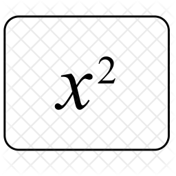

<h1>Kwadrateren</h1> 

                         

### Input

Een geheel getal

### Output

Het kwadraat van dit getal

### Voorbeeld 
<table>
  <caption> </caption>
  <tr>
    <th>Getal</th>
    <th>Kwadraat</th>
  </tr>
  <tr>
    <td>3</td>
    <td>9</td>
  </tr>
  <tr>
    <td>-12</td>
    <td>144</td>
  </tr>
</table>

**Input:**

      3

**Output:**

      9

### Voorbeeld 2

**Input:**

      -12

**Output:**

      144
      

